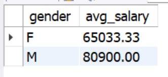
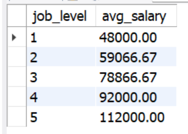
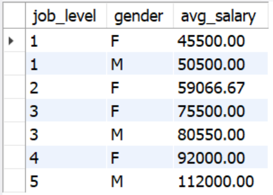
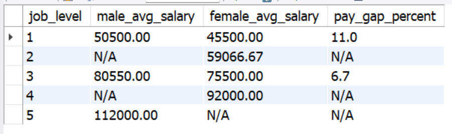

# 🐬 Pay Equity & Compensation Analysis (SQL)

This SQL project explores compensation trends and gender representation across job levels using a mock HR dataset of 10 employees.  
It focuses on identifying pay gaps, role distribution, and average salary insights using core SQL techniques.

---

## 🚀 Project Overview

This beginner-level HR analytics project answers questions such as:
- Are salaries increasing with job level?
- Are there pay differences between male and female employees?
- How is gender representation distributed across job levels?
- Where do pay gaps exist and by how much?

All queries are based on a manually entered mock dataset designed to simulate a small but meaningful HR scenario.

---

## 🛠 Tools Used
- **MySQL Workbench** – to build, query, and analyze HR compensation data
- **Manually created SQL table** – `hr_data` with 10 employees

---

## 📁 Files Included

- `pay_equity_queries.sql` – all queries used in this project
- `avg_salary_by_gender.csv` – result of gender-based salary analysis
- `avg_salary_by_level.csv` – result of job level salary analysis
- `gender_count_by_level.csv` – employee counts by level and gender
- `pay_gap_by_level.csv` – calculated pay gap percentages

---

## 🚀 How to Use This Project
To explore the analysis, open Pay_Equity_Queries.sql file and download it to your computer:  
👉 [Open SQL_Files](https://github.com/Obu541/Pay-Equity-Analysis-SQL/blob/main/Pay_Equity_Queries.sql)   
   (Recommended: Open link in a new tab)  
👉 Prefer a quick look? Scroll down to preview key data insights and examples of queries for the restaurant — no need to open the full project!


## 📌 Key Queries & Insights

### 1. Average Salary by `Gender`
```sql
SELECT gender, ROUND(AVG(salary), 2) AS avg_salary
FROM hr_data
GROUP BY gender;
```


🔍**Insight:** Males earned slightly more than females in this small dataset.

### 2. Average Salary by `Job Level`
```sql
SELECT job_level, ROUND(AVG(salary), 2) AS avg_salary
FROM hr_data
GROUP BY job_level
ORDER BY job_level;
```


🔍**Insight:** Salary increases with job level, showing a logical career-based salary structure.

### 3. Salary by `Job Level and Gender`
```sql
Copy
Edit
SELECT job_level, gender, ROUND(AVG(salary), 2) AS avg_salary
FROM hr_data
GROUP BY job_level, gender;
```


🔍**Insight:** Gender-based salary differences are visible, especially at level 3.

### 4. `Pay Gap Percentage`by Job Level
See full query in `Pay_equity_queries.sql`



🔍**Insight:** Level 1 shows an 11% gap favoring males. 
Some levels lack both genders, so the pay gap is marked as “N/A.”

📌 *Created by Olga Buriakova*  
💼 [LinkedIn](https://www.linkedin.com/in/olga-buriakova-a13163128/) | 🌐 [Portfolio](https://obu541.github.io/Portfolio/)


